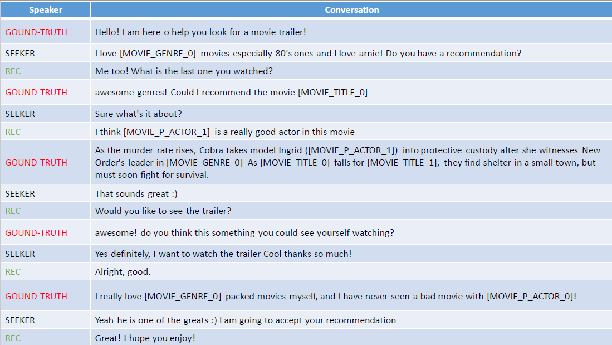

# Results & User Study Data

In this directory, we include the overall results and data for the analyses reported in the manuscript. 

1. The file named `Compiled Results.xlsx` includes the compiled results for various anlyses such as results of the user study, BLEU score, items and entities mentioned in the responses that are used in the user study.
2. The file named `RB-CRS and CRB-CRS.docx` reports the details on two CRS, i.e., RB-CRS and CRB-CRS, used for the user study. Specifically, we provide the corresponding titles and links to the source-code repositories. 
3. The files named `Rating Scores.xlsx` provides the individual ratings for both CRS and for both versions of the dataset, i.e., INSPIRED & INSPIRED2.
4. The file named `Study Data CRB-CRS.xlsx` provides the dialogs used for the user study, including CRB-CRS responses and their corresponding ratings.
5. The file named `Study Data RB-CRS.xlsx` provides the dialogs used for the user study, including RB-CRS responses and their corresponding ratings.
6. Finally, the file named `fig-dialog.pdf` shows a piece of conversation used in our study. 'REC' denotes for response to a SEEKER utterance produced with a system.

#Trick of the Day 

